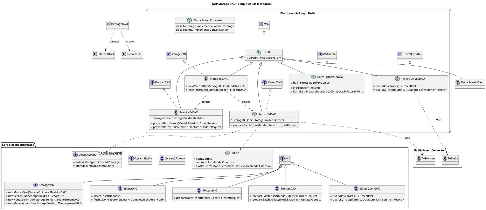
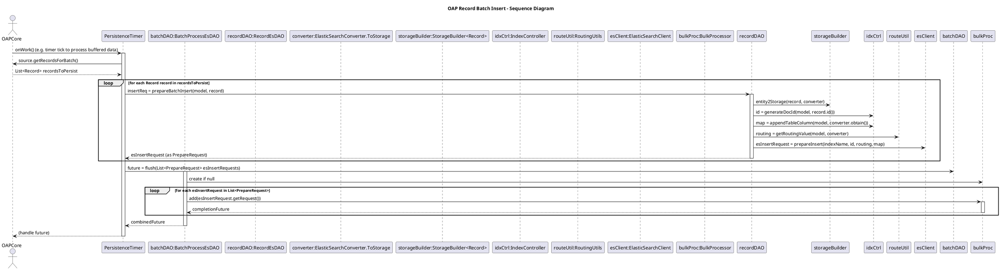
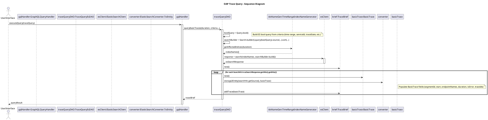
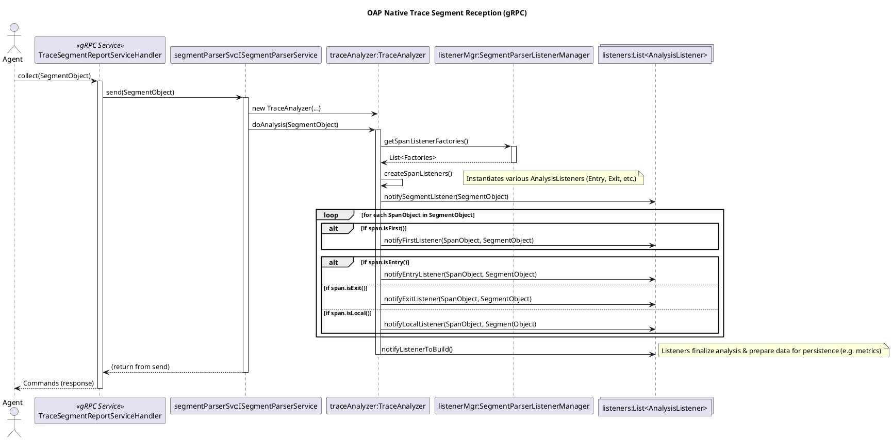
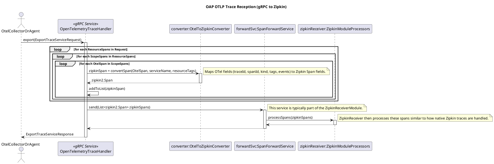

# Apache SkyWalking Implementations

This document will provide a detailed explanation of the core implementations within Apache SkyWalking.

## 1. Introduction

Apache SkyWalking is an open-source Application Performance Monitoring (APM) system specifically designed for observing and diagnosing complex distributed systems, particularly those built on microservices, cloud-native principles, and container-based architectures. It provides comprehensive observability capabilities, allowing developers and operators to gain deep insights into their application's behavior, performance bottlenecks, and overall health. SkyWalking aims to make distributed systems more transparent and manageable by offering end-to-end tracing, metrics aggregation, log correlation, and more.

## 2. Core Architecture

Apache SkyWalking's architecture is logically divided into four primary components that work together to provide comprehensive observability: Probes, the Platform Backend (Observability Analysis Platform - OAP), Storage, and a User Interface (UI). This modular design allows for flexibility and scalability.


*Source: SkyWalking Official Website*

### 2.1. Probes

Probes are responsible for collecting telemetry data from the target applications and systems. They are essentially agents or SDKs that are integrated into the services being monitored. SkyWalking supports a variety of probe types to cater to different technology stacks and environments:

*   **Language-based Native Agents:** These agents are deeply integrated with specific programming languages and runtimes. They often use bytecode manipulation (like in Java with `javaagent`) or compile-time instrumentation to automatically collect traces, metrics, and other relevant data. SkyWalking provides native agents for popular languages such as Java, .NET Core, Node.js, Python, Go, PHP, and Ruby.
*   **Service Mesh Probes:** In environments using service meshes like Istio or Linkerd, SkyWalking can collect telemetry data from the service mesh's sidecar proxies (e.g., Envoy). This allows for observability at the network level without requiring direct instrumentation of every application.
*   **3rd-party Instrument Library Receivers:** SkyWalking is designed for interoperability and can accept data from various widely-used instrumentation libraries and formats. This includes native support for Zipkin (v1 and v2 trace formats) and OpenTelemetry (OTLP traces and metrics). This allows organizations to leverage existing instrumentation or gradually migrate to SkyWalking's native probes.
*   **eBPF Agent:** For deeper system-level insights, especially in Kubernetes environments, SkyWalking utilizes an eBPF (Extended Berkeley Packet Filter) agent. This agent can collect kernel-level data for network monitoring, CPU profiling, and other low-level metrics without modifying application code, offering a powerful way to diagnose system performance.
*   **Manual SDKs:** For languages where auto-instrumentation is challenging or for custom instrumentation needs, SkyWalking provides manual SDKs (e.g., for C++, Rust, Nginx LUA).

These probes collect raw data (traces, metrics, logs, events) and forward it to the Platform Backend for processing and analysis.

### 2.2. Platform Backend (Observability Analysis Platform - OAP)

The Platform Backend, also known as the Observability Analysis Platform (OAP), is the central processing engine of SkyWalking. It receives telemetry data from the various probes, then aggregates, analyzes, and prepares it for storage and visualization. The OAP is highly scalable and can be deployed in a clustered mode to handle large volumes of data.

Key functions of the OAP include:

*   **Data Reception:** Listens for data from probes via various protocols (e.g., gRPC, HTTP).
*   **Data Aggregation:** Combines and summarizes raw data into meaningful metrics and insights. For example, calculating average response times, error rates, or request counts for services and endpoints.
*   **Topology Analysis:** Constructs and maintains a map of services and their dependencies based on trace data.
*   **Alarming:** Evaluates incoming data against user-defined rules and triggers alarms if thresholds are breached.
*   **Data Streaming & Forwarding:** Can stream processed data to other systems or forward alarms to notification channels.

To perform its analysis tasks, the OAP utilizes several powerful native analysis languages:

*   **Observability Analysis Language (OAL):** OAL scripts are used to define how SkyWalking should process metrics from incoming trace and service mesh data. Users can write OAL scripts to define what data to collect from which source (e.g., `service`, `instance`, `endpoint`) and how to aggregate it (e.g., `sum`, `avg`, `percentile`). OAL is fundamental to how SkyWalking generates metrics for service performance, instance health, and endpoint behavior from distributed traces.
*   **Meter Analysis Language (MAL):** MAL is designed for processing pre-aggregated metrics data, particularly from sources like Prometheus, OpenTelemetry's metric format, Telegraf, or SkyWalking's native meter system. MAL allows users to define how these external metrics should be ingested, processed, and mapped into SkyWalking's data model. This enables SkyWalking to act as a unified platform for metrics from diverse ecosystems.
*   **Log Analysis Language (LAL):** LAL is used to parse, structure, and extract valuable information from log data. With LAL scripts, users can define rules to:
    *   Format unstructured logs into a structured format.
    *   Extract key fields or labels from log content.
    *   Correlate logs with traces by extracting trace IDs.
    *   Generate metrics from log patterns (e.g., counting occurrences of specific error messages).

The OAP can operate in different roles, such as a `Receiver` (primarily focused on data ingestion and initial processing) or an `Aggregator` (focused on further aggregation and analysis), allowing for flexible deployment topologies.

#### 2.2.1. OAP Storage Interaction - Code Implementation Details

To understand how the OAP interacts with the storage layer, let's look at some key design patterns and code flows. The following diagrams illustrate these interactions, primarily using the Elasticsearch storage plugin as an example.

**1. Simplified Class Diagram for Storage DAOs**

This diagram shows the relationship between core SkyWalking storage DAO (Data Access Object) interfaces and their typical implementations in a storage plugin like Elasticsearch. It highlights the abstraction layer that allows SkyWalking to support multiple backend storages.



**Explanation:**
*   **Core Interfaces:** Define the contracts for storage operations (e.g., `StorageDAO` as a factory, `IBatchDAO` for batch writes, `IRecordDAO` for record-specific operations, `ITraceQueryDAO` for trace queries).
*   **`Model`:** Represents the data schema, adaptable for different backends via extensions.
*   **`StorageBuilder` & `Converter`s:** Responsible for translating between SkyWalking's internal entity format and the format required by the specific storage backend.
*   **Elasticsearch Plugin DAOs:** Concrete implementations for Elasticsearch, using an `ElasticSearchClient` and often a `BulkProcessor` for efficient batch writes. `StorageEsDAO` acts as the factory for these specific DAOs.

**2. Sequence Diagram for Record Batch Insert (Simplified)**

This diagram illustrates how a `Record` (like a trace segment) is prepared and added to a batch for insertion into Elasticsearch. It shows the roles of the `PersistenceTimer`, the specific `RecordEsDAO`, and the `BatchProcessEsDAO`.


**Explanation:**
1.  The `PersistenceTimer` (or a similar mechanism) initiates the batch persistence process.
2.  For each `Record` to be saved, the `RecordEsDAO.prepareBatchInsert` method is called.
3.  `RecordEsDAO` uses the `StorageBuilder` (via `ElasticSearchConverter`) to transform the `Record` object into a map suitable for an Elasticsearch document.
4.  It determines the Elasticsearch index name, document ID (using `IndexController`), and any routing information.
5.  An Elasticsearch `InsertRequest` is prepared.
6.  These `PrepareRequest` objects are collected and passed to `BatchProcessEsDAO.flush()`.
7.  `BatchProcessEsDAO` uses Elasticsearch's `BulkProcessor` to efficiently send these requests to the Elasticsearch cluster.

**3. Sequence Diagram for Trace Query (Simplified `queryBasicTraces`)**

This diagram shows how a typical trace query (like `queryBasicTraces`) is handled by the `TraceQueryEsDAO`, translating GraphQL query parameters into an Elasticsearch search request and then converting the results back.


**Explanation:**
1.  A query originates from the UI (e.g., via a GraphQL request).
2.  The `GraphQLQueryHandler` delegates to the appropriate DAO method, here `TraceQueryEsDAO.queryBasicTraces`.
3.  `TraceQueryEsDAO` constructs an Elasticsearch query (using `BoolQueryBuilder`, `RangeQueryBuilder`, etc.) based on the input criteria.
4.  It determines the target Elasticsearch indices (often time-bucketed).
5.  The query is executed using the `ElasticSearchClient`.
6.  The results (`SearchHit` objects) are converted back into SkyWalking's domain objects (e.g., `BasicTrace`) using the `ElasticSearchConverter`.
7.  The final result (`TraceBrief`) is returned.

#### 2.2.2. OAP Data Reception - Code Implementation Details

The OAP is designed to ingest telemetry data from a variety of sources and protocols. This section illustrates how data is received and initially processed, focusing on SkyWalking's native trace format and OTLP traces.

**1. SkyWalking Native Trace Segment Reception (gRPC)**

This diagram shows the sequence of events when a SkyWalking agent sends a trace segment to the OAP via gRPC. It highlights the roles of the gRPC handler, the `ISegmentParserService`, and the `TraceAnalyzer` which uses a listener pattern to process spans.


**Explanation:**
1.  The SkyWalking agent sends a `SegmentObject` (containing multiple spans) to the `TraceSegmentReportServiceHandler` via a gRPC call.
2.  The handler forwards the raw `SegmentObject` to the `ISegmentParserService`.
3.  `SegmentParserServiceImpl` (the concrete implementation) creates a `TraceAnalyzer`.
4.  `TraceAnalyzer` then iterates through each span in the segment.
5.  It uses a `SegmentParserListenerManager` to obtain and instantiate various `AnalysisListener`s (e.g., `EntryAnalysisListener`, `ExitAnalysisListener`, `RPCAnalysisListener`).
6.  Each listener is notified based on the span's type (entry, exit, local) or its position (first span). Listeners are responsible for specific aspects of analysis, like building metrics, service dependencies, etc.
7.  After all spans are processed, the `build()` method on each listener is called to finalize its analysis.

**2. OTLP Trace Reception (gRPC to Zipkin Conversion)**

This diagram illustrates how OTLP (OpenTelemetry Protocol) trace data is received by the OAP, converted into the Zipkin span format, and then forwarded to the Zipkin processing pipeline within SkyWalking.


**Explanation:**
1.  An OTLP agent or collector sends an `ExportTraceServiceRequest` to the `OpenTelemetryTraceHandler`.
2.  The handler iterates through the OTLP spans.
3.  Each OTLP span is converted into a `zipkin2.Span` object. This involves mapping attributes, kinds, statuses, events, and links.
4.  The list of converted Zipkin spans is then passed to the `SpanForwardService`.
5.  The `SpanForwardService` (part of SkyWalking's Zipkin receiver module) forwards these Zipkin spans to the Zipkin processing pipeline, which handles them as if they originated from a native Zipkin agent. This demonstrates SkyWalking's strategy of normalizing some external formats to well-supported internal or intermediate representations.

**3. Conceptual Overview of Data Reception Dispatch**

This diagram provides a higher-level view of how various receiver plugins connect to different core analysis services within the OAP.

```plantuml
@startuml
title OAP Data Reception - Conceptual Dispatch

package "Receiver Plugins" <<Node>> {
  component [SkyWalking gRPC Receivers] <<hexagon>> as SWGrpcReceiver {
    portin gRPC_Port
  }
  component [OTLP gRPC Receiver] <<hexagon>> as OtlpGrpcReceiver {
    portin OTLP_gRPC_Port
  }
  component [Kafka Receiver] <<hexagon>> as KafkaReceiver {
    portin KafkaTopic
  }
  component [HTTP Receiver] <<hexagon>> as HttpReceiver {
    portin HTTP_Endpoint
  }
  component [Zipkin HTTP Receiver] <<hexagon>> as ZipkinHttpReceiver {
    portin Zipkin_HTTP_Endpoint
  }
}

package "OAP Core - Analysis/Parsing" <<Cloud>> {
  component [ISegmentParserService
(TraceAnalyzer)] as SegmentParser
  component [IMetricsParserService
(MeterSystem)] as MetricsParser
  component [ILogAnalysisService] as LogParser
  component [IZipkinTraceParser] as ZipkinParser
  component [IEventParserService] as EventParser
}

SWGrpcReceiver --> SegmentParser : SegmentObject
SWGrpcReceiver --> MetricsParser : MeterData
SWGrpcReceiver --> LogParser : LogData
SWGrpcReceiver --> EventParser : EventData

OtlpGrpcReceiver --> Converter_OTLP_to_Zipkin : OTLP Traces
OtlpGrpcReceiver --> Converter_OTLP_to_SW_Meter : OTLP Metrics
OtlpGrpcReceiver --> Converter_OTLP_to_SW_Log : OTLP Logs

package "Converters" <<Frame>> {
    component [OTLP to Zipkin Span Converter] as Converter_OTLP_to_Zipkin
    component [OTLP to SW Meter Converter] as Converter_OTLP_to_SW_Meter
    component [OTLP to SW Log Converter] as Converter_OTLP_to_SW_Log
}
Converter_OTLP_to_Zipkin --> ZipkinParser : zipkin2.Span
Converter_OTLP_to_SW_Meter --> MetricsParser : SkyWalking MeterData
Converter_OTLP_to_SW_Log --> LogParser : SkyWalking LogData


KafkaReceiver --> SegmentParser : SegmentObject (from Kafka)
KafkaReceiver --> MetricsParser : MeterData (from Kafka)

HttpReceiver --> SegmentParser : SegmentObject (from HTTP)

ZipkinHttpReceiver --> ZipkinParser : zipkin2.Span

@enduml
```
**Explanation:**
*   Various receiver plugins (gRPC, Kafka, HTTP) listen for incoming data on different ports or topics.
*   SkyWalking native gRPC receivers typically forward data directly to specialized parsing services in the OAP core (e.g., `ISegmentParserService` for traces, `IMetricsParserService` for metrics).
*   Receivers for third-party protocols (like OTLP) often involve a conversion step. For instance, OTLP traces are converted to Zipkin spans before being sent to the `IZipkinTraceParser`. OTLP metrics might be converted to SkyWalking's native meter format.
*   This illustrates a flexible architecture where different data sources are normalized and then processed by common analysis pipelines.

#### 2.2.3. OAP Trace Processing - Code Implementation Details

Once native SkyWalking trace segments are received (as seen in Data Reception), they are passed to the `ISegmentParserService`, which utilizes the `TraceAnalyzer` to dissect and analyze the trace data. This processing is key to generating metrics, understanding service topology, and persisting trace information.

**1. TraceAnalyzer and Listener Interaction**

This sequence diagram details how the `TraceAnalyzer` processes a `SegmentObject`. It highlights the dynamic loading of `AnalysisListener` implementations and how these listeners are notified at different stages of span processing (e.g., when an entry span is encountered, when an exit span is found, or for the segment as a whole).

```plantuml
@startuml
title OAP TraceAnalyzer - Listener Interaction

participant "parserSvc:SegmentParserServiceImpl" as ParserSvc
participant "analyzer:TraceAnalyzer" as Analyzer
participant "listenerMgr:SegmentParserListenerManager" as ListenerManager
collections "factories:List<AnalysisListenerFactory>" as Factories
collections "listeners:List<AnalysisListener>" as Listeners
participant "segmentListener:SegmentAnalysisListener" as SegmentListener
participant "entryListener:SomeEntryListener" as EntryListener  // Example concrete listener
participant "exitListener:SomeExitListener" as ExitListener    // Example concrete listener
participant "sourceReceiver:SourceReceiver" as SourceReceiver

ParserSvc -> Analyzer : doAnalysis(SegmentObject)
activate Analyzer

Analyzer -> ListenerManager : factories = getSpanListenerFactories()
activate ListenerManager
ListenerManager --> Analyzer : factories
deactivate ListenerManager

loop for each factory in factories
    Analyzer -> factory : listener = create(...)
    Analyzer -> Listeners : add(listener)
end
note right of Analyzer : Listeners now contains instances like
SegmentAnalysisListener, specific metric listeners, etc.

Analyzer -> Listeners : notifySegmentListener(SegmentObject)
note right: Each listener implementing SegmentListener (e.g., SegmentAnalysisListener)
 will have its parseSegment() called.
Listeners -> SegmentListener : parseSegment(SegmentObject)
activate SegmentListener
SegmentListener -> SegmentListener : // determines sampling, overall segment times, errors, tags
deactivate SegmentListener


loop for each span in SegmentObject.getSpansList()
    alt if span.isFirst()
        Analyzer -> Listeners : notifyFirstListener(span, SegmentObject)
        note right: e.g., SegmentAnalysisListener.parseFirst()
        Listeners -> SegmentListener : parseFirst(span, SegmentObject)
        activate SegmentListener
        SegmentListener -> SegmentListener : // initializes Segment source object
        deactivate SegmentListener
    end

    alt if span.getType() == SpanType.Entry
        Analyzer -> Listeners : notifyEntryListener(span, SegmentObject)
        note right: e.g., SomeEntryListener.parseEntry(), SegmentAnalysisListener.parseEntry()
        Listeners -> EntryListener : parseEntry(span, SegmentObject)
        activate EntryListener
        EntryListener -> EntryListener : // processes entry span data
        deactivate EntryListener
        Listeners -> SegmentListener : parseEntry(span, SegmentObject)
        activate SegmentListener
        SegmentListener -> SegmentListener : // updates endpoint info if needed
        deactivate SegmentListener
    else if span.getType() == SpanType.Exit
        Analyzer -> Listeners : notifyExitListener(span, SegmentObject)
        Listeners -> ExitListener : parseExit(span, SegmentObject)
        activate ExitListener
        ExitListener -> ExitListener : // processes exit span data, detects dependencies
        deactivate ExitListener
    else if span.getType() == SpanType.Local
        Analyzer -> Listeners : notifyLocalListener(span, SegmentObject)
        note right: Similar flow for local span listeners
    end
end

Analyzer -> Listeners : notifyListenerToBuild()
note right: Each listener finalizes its analysis.
Listeners -> SegmentListener : build()
activate SegmentListener
SegmentListener -> SourceReceiver : receive(Segment source)
SegmentListener -> SourceReceiver : receive(TagAutocomplete source)
deactivate SegmentListener

Listeners -> EntryListener : build()
activate EntryListener
EntryListener -> SourceReceiver : receive(EndpointMetric source) // Example: Metric derived from entry spans
deactivate EntryListener

Listeners -> ExitListener : build()
activate ExitListener
ExitListener -> SourceReceiver : receive(ServiceDependencyMetric source) // Example: Metric derived from exit spans
deactivate ExitListener

deactivate Analyzer
@enduml
```
**Explanation:**
1.  `SegmentParserServiceImpl` invokes `TraceAnalyzer.doAnalysis()` with the received `SegmentObject`.
2.  `TraceAnalyzer` first obtains all registered `AnalysisListenerFactory` instances from the `SegmentParserListenerManager` and creates concrete listener instances.
3.  It then iterates through the segment and its spans, notifying listeners at specific points:
    *   `parseSegment()`: For listeners interested in the entire segment (e.g., `SegmentAnalysisListener` for sampling, overall timing, and preparing the `Segment` source record).
    *   `parseFirst()`: For the first span in the segment.
    *   `parseEntry()`, `parseExit()`, `parseLocal()`: Based on the `SpanType` of each span. Multiple listeners can act on the same span.
4.  After all spans are processed, `TraceAnalyzer` calls the `build()` method on each listener.
5.  In their `build()` method, listeners finalize their analysis and use the `SourceReceiver` to push the generated data (e.g., `Segment` records, `EndpointMetric`s, `ServiceDependencyMetric`s) into the OAP's downstream processing pipeline (which includes OAL execution, aggregation, and storage).

**2. Conceptual Data Flow from Span to Source Records**

This diagram provides a higher-level conceptual view of how different `AnalysisListener`s might process spans to generate various types of "source records" (raw data entities) that feed into the OAP's stream processing and OAL engine.

```plantuml
@startuml
title OAP Trace Processing - Span to Source Records

artifact "SegmentObject" as SegmentIn {
    + serviceName
    + instanceName
    + List<SpanObject> spans
}

package "TraceAnalyzer & Listeners" <<Cloud>> {
    component "TraceAnalyzer" as TA
    folder "AnalysisListeners" {
        component "SegmentAnalysisListener" as SL
        component "EndpointAnalysisListener
(processes Entry/Local spans)" as EL
        component "ServiceInstanceListener
(processes Entry/Local/Exit spans)" as SIL
        component "DependencyAnalysisListener
(processes Exit/Entry spans)" as DL
        component "VirtualDatabaseListener
(processes DB Exit spans)" as VDBL
    }
}

package "OAP Core - Source Processing" <<Node>> {
    component "SourceReceiver" as SR
    queue "DownstreamQueues
(leading to OAL, Aggregation, Storage)" as DQ
}

artifact "Segment Record
(raw trace segment data)" as SegmentOut
artifact "EndpointMetric
(latency, success rate per endpoint)" as EndpointMetricOut
artifact "ServiceInstanceMetric
(throughput, latency per instance)" as InstanceMetricOut
artifact "ServiceDependency
(calls between services)" as ServiceDepOut
artifact "DatabaseMetric
(calls to databases)" as DBMetricOut


SegmentIn --> TA : doAnalysis()

TA --> SL : SpanObject, SegmentObject
TA --> EL : SpanObject (Entry/Local)
TA --> SIL : SpanObject (Entry/Local/Exit)
TA --> DL : SpanObject (Exit/Entry)
TA --> VDBL : SpanObject (Exit, DB Type)


SL --> SR : (Segment Record) SegmentOut
EL --> SR : (EndpointMetric) EndpointMetricOut
SIL --> SR : (ServiceInstanceMetric) InstanceMetricOut
DL --> SR : (ServiceDependency) ServiceDepOut
VDBL --> SR : (DatabaseMetric) DBMetricOut

SR --> DQ : (various source records)

note bottom of TA
  TraceAnalyzer dispatches spans
  to registered listeners based on
  span type and listener interest.
  Each listener extracts relevant data
  and constructs specific source records.
end note

note bottom of SR
  SourceReceiver acts as the entry point
  for all analyzed data (source records)
  into the OAP's stream processing system,
  which then feeds into OAL script execution,
  metric aggregation, and ultimately storage.
end note

@enduml
```
**Explanation:**
*   The `TraceAnalyzer` receives a `SegmentObject`.
*   It passes spans to various specialized `AnalysisListener`s. For example:
    *   `SegmentAnalysisListener`: Creates the main `Segment` record for storage.
    *   `EndpointAnalysisListener`: Might generate `EndpointMetric` source records from entry or local spans.
    *   `ServiceInstanceListener`: Might generate `ServiceInstanceMetric` source records.
    *   `DependencyAnalysisListener`: Processes exit and entry spans to build `ServiceDependency` records, forming the basis of the service topology map.
    *   `VirtualDatabaseListener`: Identifies database calls from exit spans and generates `DatabaseMetric` source records.
*   Each listener, after processing its relevant span data, creates specific source record objects.
*   These source records are all sent to the `SourceReceiver`.
*   The `SourceReceiver` then pushes these records into downstream queues, making them available for further processing by the OAL engine (for metrics defined in OAL scripts), aggregation workers, and eventually the storage layer.

This listener-based architecture allows SkyWalking to flexibly extract a wide variety of metrics and relationship data from a single trace segment.

#### 2.2.4. OAP OAL Execution - Conceptual Flow

The Observability Analysis Language (OAL) is a powerful feature in SkyWalking that allows users to define how metrics should be generated and aggregated from various source data (including trace spans, service calls, etc.). Due to challenges in detailed code exploration of the OAL runtime module (`oal-rt`) with available tools, the following diagram provides a high-level conceptual view of the OAL execution flow.

**1. Conceptual OAL Execution Flow**

This diagram illustrates the lifecycle of OAL processing, from script definition to metric persistence.

```plantuml
@startuml
title OAP OAL Execution - Conceptual Flow

package "Configuration & Setup" <<Folder>> {
    file ".oal Scripts" as OalScripts
    component "OAL Grammar (ANTLR)" as OalGrammar
    component "OAL Script Parser" as OalScriptParser
    component "OAL Engine/Runtime" as OalEngine
}

package "Data Ingestion & Initial Processing" <<Cloud>> {
    actor Agent
    component "OAP Receivers
(gRPC, HTTP, Kafka)" as Receivers
    component "TraceAnalyzer + Listeners" as TraceAnalyzer
    component "SourceReceiver" as CoreSourceReceiver
    queue "SourceRecord Queue" as SourceQueue
}

package "OAL Metric Generation" <<Node>> {
    component "OAL Worker/Processor" as OalWorker
    database "Generated Metrics
(in-memory, e.g., Service_SLA_Metrics)" as InMemoryMetrics
    note left of OalWorker
      Consumes SourceRecords.
      Matches against OAL rules.
      Updates/aggregates metrics.
    end note
}

package "Metric Persistence" <<Database_Storage>> {
    component "Metrics Persistence Scheduler
(e.g., PersistenceTimer)" as MetricsScheduler
    component "IMetricsDAO" as MetricsDAO
    database "Storage
(Elasticsearch, BanyanDB, etc.)" as ActualStorage
}

OalScripts --> OalScriptParser : loaded at startup
OalGrammar --> OalScriptParser : used by
OalScriptParser --> OalEngine : (supplies parsed rules/AST)
OalEngine --> OalWorker : (provides rules/context for matching)


Agent --> Receivers : Raw Telemetry Data
Receivers --> TraceAnalyzer : (e.g. SegmentObject)
TraceAnalyzer --> CoreSourceReceiver : (e.g. ServiceMetric, EndpointDependency source records)
CoreSourceReceiver --> SourceQueue : Enqueues SourceRecord

SourceQueue --> OalWorker : Consumes SourceRecord (e.g., Endpoint, ServiceRelation)

OalWorker -> OalEngine : Match(SourceRecord) against OAL rules
OalEngine --> OalWorker : Matched OAL Rules & Metric Targets

OalWorker -> InMemoryMetrics : Update/Aggregate Metric
note right of InMemoryMetrics
 Based on OAL definition:
 e.g., for `service_sla = from(Endpoint.latency).longAvg()`
 an Endpoint source record triggers update of
 sum and count for the relevant service's SLA metric.
end note

MetricsScheduler -> InMemoryMetrics : Read Metrics for Persistence (periodically)
MetricsScheduler -> MetricsDAO : save(metric)
MetricsDAO -> ActualStorage : Store Metric

@enduml
```
**Explanation of Conceptual Flow:**

1.  **Configuration & Setup (Startup Phase):**
    *   `.oal Scripts` containing metric definitions are read from the SkyWalking distribution (e.g., `oal-scripts` directory or bundled).
    *   The `OAL Script Parser`, using the `OAL Grammar` (defined with ANTLR), parses these scripts into an executable format or an Abstract Syntax Tree (AST).
    *   The `OAL Engine/Runtime` is initialized with these parsed rules. It understands the relationships between source data types (e.g., `Endpoint`, `ServiceRelation`), the metrics to be generated (e.g., `service_sla`, `endpoint_avg_latency`), and the aggregation functions to apply (e.g., `longAvg`, `sum`, `percentile`).

2.  **Data Ingestion & Source Record Generation:**
    *   Raw telemetry data is ingested by `OAP Receivers`.
    *   Initial processing (e.g., by `TraceAnalyzer` and its listeners) converts this raw data into various fine-grained `SourceRecord`s (e.g., an `Endpoint` source record representing a call to a specific endpoint, a `ServiceRelation` source record representing a detected dependency).
    *   These `SourceRecord`s are passed to the `SourceReceiver`.
    *   The `SourceReceiver` enqueues these records, making them available for different stream processors, including the OAL engine.

3.  **OAL Metric Generation (Runtime Processing):**
    *   `OAL Worker/Processor` threads consume `SourceRecord`s from the queue.
    *   For each `SourceRecord`, the worker consults the `OAL Engine`. The engine determines if this type of `SourceRecord` is used as a source in any of the loaded OAL rules.
    *   If a match is found, the OAL worker extracts the necessary data from the `SourceRecord` as specified in the OAL rule (e.g., extracting `latency` from an `Endpoint` source).
    *   The worker then updates the corresponding metric instance held in `InMemoryMetrics`. This involves applying the aggregation logic (e.g., for `longAvg`, it would update a running sum and count for the specific metric entity like a particular service or endpoint).

4.  **Metric Persistence:**
    *   The `InMemoryMetrics` are not persisted immediately upon every update to avoid excessive I/O.
    *   A `Metrics Persistence Scheduler` (like the `PersistenceTimer`) runs periodically.
    *   When triggered, it reads the current values of all aggregated metrics from `InMemoryMetrics`.
    *   It then uses the `IMetricsDAO` (e.g., `MetricsEsDAO`) to save these aggregated metric values to the configured backend `Storage`.

This flow allows SkyWalking to dynamically define and calculate a wide range of metrics from the telemetry data it collects, forming a core part of its analysis capabilities.

#### 2.2.5. OAP Query Handling - Conceptual Flow

The SkyWalking UI and external APIs query the OAP to retrieve telemetry data for visualization and analysis. This typically involves GraphQL queries.

**1. Conceptual GraphQL Query Flow**

This diagram shows a simplified sequence of how a GraphQL query from the UI is processed by the OAP, leading to data retrieval from storage.

```plantuml
@startuml
title OAP GraphQL Query - Conceptual Flow

actor UserInterface
participant "SkyWalking UI / API Client" as Client
participant "OAP GraphQL Endpoint
(e.g., /graphql)" as GraphQLEndpoint
participant "GraphQLQueryHandler
(or similar dispatcher)" as GQLHandler
participant "Specific Query Service
(e.g., TraceQueryService, MetricQueryService)" as QueryService
participant "Storage DAO
(e.g., ITraceQueryDAO, IMetricsQueryDAO)" as StorageDAO
database "Storage Backend
(Elasticsearch, BanyanDB)" as Storage

Client -> GraphQLEndpoint : POST /graphql (query: "...")
activate GraphQLEndpoint
GraphQLEndpoint -> GQLHandler : processQuery(GraphQLRequest)
activate GQLHandler

GQLHandler -> GQLHandler : parseAndValidate(query)
note right: Uses GraphQL Java library
to parse the query and match
it against the OAP's GraphQL schema.

GQLHandler -> QueryService : executeQueryMethod(parsedQueryArgs)
activate QueryService
note right of QueryService
  The GQLHandler dispatches to a specific
  method in a QueryService based on
  the GraphQL query's field name.
  (e.g., "queryTraces", "readMetrics")
end note

QueryService -> StorageDAO : fetchData(queryCriteria)
activate StorageDAO
note right of StorageDAO
  QueryCriteria are derived from
  GraphQL arguments (e.g., duration,
  serviceId, metricName).
end note
StorageDAO -> Storage : executeDBQuery(nativeQuery)
activate Storage
Storage --> StorageDAO : DBNativeResults
deactivate Storage
StorageDAO -> StorageDAO : mapResultsToDomainObjects(DBNativeResults)
StorageDAO --> QueryService : DomainData (e.g., List<TraceBrief>, List<MetricValues>)
deactivate StorageDAO

QueryService --> GQLHandler : QueryResult
deactivate QueryService

GQLHandler -> GraphQLEndpoint : formatResponse(QueryResult)
GraphQLEndpoint --> Client : GraphQLResponse (JSON)
deactivate GQLHandler
deactivate GraphQLEndpoint

@enduml
```
**Explanation of Conceptual Flow:**

1.  **Query Submission:**
    *   The `SkyWalking UI` or an external API client sends a GraphQL query to the OAP's `GraphQL Endpoint` (commonly `/graphql`).

2.  **GraphQL Handling:**
    *   The `GraphQLQueryHandler` (or a similar component responsible for GraphQL request processing) receives the request.
    *   It uses a GraphQL library (like GraphQL Java) to parse the incoming query string, validate it against the OAP's defined GraphQL schema, and prepare it for execution. The schema defines all available query types, fields, and arguments.

3.  **Dispatch to Query Service:**
    *   Based on the fields requested in the GraphQL query, the `GraphQLQueryHandler` dispatches the request to a specific method within a relevant `QueryService`. SkyWalking has various query services for different data types, such as:
        *   `TraceQueryService`: For trace-related queries.
        *   `MetricQueryService`: For metrics queries.
        *   `MetadataQueryService`: For service, instance, endpoint metadata.
        *   `AlarmQueryService`: For alarm data.
        *   `LogQueryService`: For log data.

4.  **Data Access via DAO:**
    *   The invoked method in the `QueryService` translates the GraphQL query arguments into specific criteria.
    *   It then calls the appropriate `Storage DAO` (Data Access Object) to fetch the data. For example, `ITraceQueryDAO.queryBasicTraces()` or `IMetricsQueryDAO.readMetricsValues()`.
    *   The DAO is responsible for abstracting the underlying storage mechanism.

5.  **Storage Interaction:**
    *   The `Storage DAO` constructs a native query understandable by the configured `Storage Backend` (e.g., an Elasticsearch query, a BanyanDB query, or an SQL query).
    *   The query is executed against the storage.
    *   The native results from the database are returned to the DAO.

6.  **Result Mapping & Return:**
    *   The `Storage DAO` maps the native database results into SkyWalking's internal domain objects (e.g., `TraceBrief`, `MetricValues`).
    *   These domain objects are returned to the `QueryService`.
    *   The `QueryService` returns this data to the `GraphQLQueryHandler`.

7.  **Response Formatting:**
    *   The `GraphQLQueryHandler` takes the data returned by the query service and formats it into a standard GraphQL JSON response, matching the structure requested in the original query.
    *   This JSON response is sent back to the client.

This flow ensures that queries are handled in a structured way, leveraging the power of GraphQL for flexible data retrieval while abstracting the specifics of the storage backend. The OAP's GraphQL schema serves as the contract for all queryable data.

#### 2.2.6. OAP Alarming Engine - Conceptual Flow

The OAP includes an alarming engine that checks incoming telemetry data against user-defined rules and triggers alerts if conditions are met.

**1. Conceptual Alarming Flow**

This diagram outlines the general process of how alarms are defined, how data is checked, and how notifications are sent.

```plantuml
@startuml
title OAP Alarming Engine - Conceptual Flow

package "Configuration" <<Folder>> {
    file "alarm-settings.yml" as AlarmRulesConfig
    note bottom of AlarmRulesConfig
      Defines alarm rules, including:
      - Metric name (e.g., service_sla, endpoint_percentile)
      - Scope (Service, Endpoint, Instance)
      - Threshold
      - Operator (>, <, >=, <=)
      - Period (how long to check)
      - Count (how many times threshold must be breached)
      - Silence period
      - Webhook URLs for notification
    end note
}

package "OAP Core Processing" <<Cloud>> {
    component "AlarmRuleLoader" as RuleLoader
    component "AlarmCheckerScheduler" as CheckerScheduler
    component "MetricQueryService / DAO" as MetricReader
    database "Storage (Metrics)" as MetricsStorage
    component "AlarmCore" as AlarmCoreEngine
    queue "AlarmRecordQueue" as AlarmQueue
}

package "Alarm Notification" <<Node>> {
    component "WebhookNotifier" as WebhookNotifier
    actor "External System" as ExternalSystem
}

AlarmRulesConfig --> RuleLoader : Loads rules at startup / periodically
RuleLoader --> AlarmCoreEngine : Updates active alarm rules

CheckerScheduler -> AlarmCoreEngine : triggerChecks() (periodically for each rule)
activate AlarmCoreEngine

AlarmCoreEngine -> MetricReader : queryMetrics(rule.metricName, rule.scope, timeWindow)
activate MetricReader
MetricReader -> MetricsStorage : fetch relevant metrics
MetricsStorage --> MetricReader : metricValues
MetricReader --> AlarmCoreEngine : metricValues
deactivate MetricReader

AlarmCoreEngine -> AlarmCoreEngine : evaluateRule(metricValues, rule)
note right
  - Checks if metric value breaches threshold.
  - Considers period, count, silence period.
  - If rule is triggered => Generate AlarmRecord
end note

alt if alarm rule triggered AND not silenced
    AlarmCoreEngine -> AlarmQueue : enqueue(AlarmRecord)
end

deactivate AlarmCoreEngine

AlarmQueue --> WebhookNotifier : consumes AlarmRecord
activate WebhookNotifier
WebhookNotifier -> ExternalSystem : sendAlarmNotification(WebhookURL, AlarmRecord)
deactivate WebhookNotifier

@enduml
```
**Explanation of Conceptual Flow:**

1.  **Configuration:**
    *   Alarm rules are defined in `alarm-settings.yml` (or a similar configuration file). These rules specify the metric to monitor, the scope (e.g., service, endpoint, instance), threshold, comparison operator, duration of observation (period), number of times the threshold must be breached (count), and notification details (like webhook URLs).
    *   The `AlarmRuleLoader` reads these rules when the OAP starts and may periodically refresh them.

2.  **Scheduled Checking:**
    *   The `AlarmCheckerScheduler` periodically triggers the `AlarmCoreEngine` to evaluate active alarm rules. This is not necessarily tied to individual data points coming in but rather runs at defined intervals for each rule.

3.  **Metric Retrieval:**
    *   For each rule being checked, the `AlarmCoreEngine` uses a `MetricQueryService` (or directly a metrics DAO) to fetch the relevant metric data from the `MetricsStorage`. The query will specify the metric name, scope ID (e.g., specific service ID), and the time window defined by the rule's `period`.

4.  **Rule Evaluation:**
    *   The `AlarmCoreEngine` evaluates the retrieved metric values against the conditions defined in the alarm rule:
        *   It compares the metric value against the `threshold` using the specified `operator`.
        *   It checks if this condition has persisted for the required `period` and `count`.
        *   It also considers any `silence period` to prevent flapping alerts.
    *   If all conditions for an alarm are met, an `AlarmRecord` is generated.

5.  **Alarm Queuing & Notification:**
    *   The generated `AlarmRecord` (containing details about the alarm, the triggering metric, and its value) is enqueued into an `AlarmRecordQueue`.
    *   Dedicated notifier components, like the `WebhookNotifier`, consume `AlarmRecord`s from this queue.
    *   The `WebhookNotifier` sends a notification (e.g., an HTTP POST request with alarm details in JSON format) to the configured webhook URL(s), allowing integration with external alerting systems or messaging platforms.

This conceptual flow enables SkyWalking to proactively monitor metrics and alert users or systems when predefined conditions indicate potential issues. The separation of concerns (rule loading, scheduled checking, metric querying, rule evaluation, and notification) allows for a flexible and robust alarming system.

### 2.3. Storage

SkyWalking requires a storage solution to persist the telemetry data processed by the OAP. The storage component is designed to be pluggable, allowing users to choose a backend that best fits their operational needs and existing infrastructure. SkyWalking provides official support for several storage options:

*   **Elasticsearch:** A popular choice for its powerful search and analytics capabilities, suitable for large-scale deployments.
*   **BanyanDB:** A new observability database specifically designed and built by the SkyWalking team, optimized for APM data like traces, metrics, and logs. It aims for high performance and efficient storage for observability workloads.
*   **H2:** An in-memory relational database, primarily used for development, testing, or small-scale preview deployments.
*   **MySQL/TiDB:** Relational databases that can also be used for storing SkyWalking data, offering familiarity for teams accustomed to SQL-based systems.
*   **OpenSearch:** An open-source fork of Elasticsearch, also supported as a storage backend.
*   **InfluxDB:** A time-series database that can be suitable for metrics storage.

The OAP interacts with the chosen storage backend through a defined interface, writing processed data and reading it back for queries from the UI or API.

### 2.4. User Interface (UI)

The User Interface (UI) is a web-based application that allows users to visualize, query, and manage the observability data collected and processed by SkyWalking. Key features of the UI include:

*   **Topology Graphs:** Visualizing the relationships and dependencies between services.
*   **Dashboards:** Displaying key metrics for services, instances, and endpoints (e.g., request rates, response times, error rates).
*   **Trace Querying:** Searching for and examining individual distributed traces to understand request flows and identify bottlenecks.
*   **Log Visualization:** Viewing and searching logs, often correlated with traces.
*   **Alarm Management:** Viewing and managing active alarms.
*   **Profiling Dashboards:** Visualizing profiling data to identify performance hotspots at the code level.

The UI communicates with the OAP (typically via GraphQL APIs) to fetch the data it displays. SkyWalking provides a default web UI, and there are also integrations with other visualization tools like Grafana.

## 3. Key Telemetry Types

SkyWalking is designed to collect, analyze, and visualize a variety of telemetry data types to provide a holistic view of distributed system performance and behavior. The primary telemetry types include:

### 3.1. Tracing

Distributed tracing is a cornerstone of SkyWalking. It allows you to follow the path of a request as it propagates through multiple services in a distributed environment.

*   **Implementation:** Probes automatically (or with manual SDKs) inject correlation IDs (Trace IDs, Segment IDs, Span IDs) into request headers or messages. Each service that processes the request generates one or more "spans," representing a unit of work (e.g., an HTTP call, a database query). These spans are collected by the OAP, which reconstructs the entire end-to-end trace.
*   **Insights:** Traces help identify latency bottlenecks, understand service dependencies, visualize request flows, and pinpoint errors within a complex transaction. SkyWalking uses this data to build service topology maps.

### 3.2. Metrics

Metrics are numerical measurements of system performance and behavior over time. SkyWalking collects and aggregates various metrics at different levels (service, instance, endpoint, process).

*   **Implementation:**
    *   **OAL-generated Metrics:** The OAP uses Observability Analysis Language (OAL) to derive metrics from trace data (e.g., calculating service throughput, error rates, and latency percentiles from spans).
    *   **Meter System:** SkyWalking has its own meter system for custom application metrics. Probes can send these custom metrics directly.
    *   **External Metric Ingestion:** Through Meter Analysis Language (MAL), SkyWalking ingests metrics from external systems like Prometheus, OpenTelemetry Metrics, and Telegraf, allowing for a unified view.
*   **Insights:** Metrics provide quantitative data on system health, resource utilization, performance trends, and adherence to Service Level Objectives (SLOs). They are crucial for dashboards, alerting, and capacity planning.

### 3.3. Logging

Logs provide detailed, timestamped records of events occurring within applications and systems. SkyWalking enhances logging by enabling correlation with traces and extracting metrics from log data.

*   **Implementation:**
    *   **Agent-based Log Collection:** Some SkyWalking agents can automatically collect logs and inject trace context (Trace IDs) into log entries, enabling direct correlation between a specific trace and related logs.
    *   **Log Forwarders & Ingestion:** SkyWalking can receive logs from common log forwarders (e.g., Fluentd, Filebeat) or directly via its log ingestion APIs.
    *   **Log Analysis Language (LAL):** LAL scripts are used in the OAP to parse log formats, extract structured data, and potentially generate metrics from log content (e.g., counting specific error codes).
*   **Insights:** Logs are invaluable for debugging issues, understanding error conditions, and auditing system activity. Correlating logs with traces significantly speeds up root cause analysis.

### 3.4. Profiling

Profiling helps identify performance bottlenecks at the code level by analyzing the execution time and frequency of function calls within an application.

*   **Implementation:** SkyWalking's native language agents and its eBPF Rover agent support profiling. They can collect stack traces at intervals, allowing the OAP to build a picture of where an application is spending its CPU time. This includes on-CPU and off-CPU profiling.
*   **Insights:** Profiling data helps developers pinpoint inefficient code sections, optimize resource usage, and improve application performance. SkyWalking's UI provides visualizations of profiling data, such as flame graphs.

### 3.5. Events

Events represent significant occurrences within the monitored systems or within SkyWalking itself. These are discrete records of important moments.

*   **Implementation:** Systems can report events to SkyWalking (e.g., a new service deployment, a configuration change, a critical error alert from another system). SkyWalking can also generate internal events.
*   **Insights:** Events provide context to changes in telemetry data. For example, a sudden increase in latency might be correlated with a deployment event. Linking events with metrics, traces, and logs helps in understanding the impact of these occurrences.

## 4. Data Flow Overview

The general flow of telemetry data within the Apache SkyWalking ecosystem can be summarized as follows:

1.  **Collection (Probes):**
    *   SkyWalking probes (language agents, SDKs, service mesh collectors, eBPF agents, or 3rd-party receivers like OTLP/Zipkin) are deployed within or alongside the target applications and infrastructure.
    *   These probes capture raw telemetry data: traces (spans), metrics, logs, and profiling data as applications handle requests and execute operations.

2.  **Transmission:**
    *   Probes send the collected data to the SkyWalking Platform Backend (OAP) instances. This communication typically happens over network protocols like gRPC or HTTP/S.

3.  **Processing & Analysis (OAP):**
    *   The OAP receives the raw data.
    *   **Trace Processing:** Spans are assembled into complete distributed traces. Service topology maps are generated or updated.
    *   **Metric Processing:**
        *   Metrics are derived from trace data using OAL scripts.
        *   Meter data from native agents or external systems (Prometheus, OpenTelemetry) is processed using MAL scripts.
    *   **Log Processing:** Logs are parsed, structured (if necessary), and correlated with traces using LAL scripts. Metrics might also be extracted from logs.
    *   **Profiling Data Processing:** Profiling snapshots are analyzed to identify hotspots.
    *   **Alarming:** Data is continuously evaluated against predefined alarm rules.
    *   The OAP performs necessary aggregations (e.g., time-bucketing of metrics).

4.  **Storage:**
    *   The processed and aggregated data (traces, metrics, indexed logs, topology information, alarms, etc.) is written by the OAP to the configured storage backend (e.g., Elasticsearch, BanyanDB, MySQL).

5.  **Visualization & Querying (UI & API):**
    *   End-users interact with the SkyWalking UI (or other tools like Grafana via plugins).
    *   The UI sends queries (typically GraphQL) to the OAP's API endpoints.
    *   The OAP retrieves the requested data from the storage backend, performs any final query-time aggregation or formatting, and returns it to the UI.
    *   Users can then view dashboards, explore traces, analyze logs, and investigate performance issues.

This flow enables SkyWalking to provide a near real-time, comprehensive view of the health and performance of distributed applications.

## 5. Core Concepts Definition

SkyWalking uses a set of well-defined concepts to model and represent the components of a monitored distributed system. Understanding these terms is crucial for interpreting the data presented by SkyWalking:

*   **Layer (Layer):**
    *   A **Layer** represents an abstract framework or technological domain in computer science. Examples include Operating Systems (e.g., `OS_LINUX`), Kubernetes (`k8s`), Service Mesh (`mesh`), or even general categories like `BROWSER` for client-side applications.
    *   Services typically belong to one primary layer, though in some complex scenarios, a service might be associated with multiple layers (e.g., a service running in Kubernetes managed by Istio could relate to both `k8s` and `mesh` layers).
    *   Layers help in organizing and scoping observability data.

*   **Service (Service):**
    *   Represents a logical grouping of workloads that provide the same functionality or set of behaviors for incoming requests. This is one ofr the most fundamental concepts.
    *   The service name is usually defined by the user during agent configuration or can be discovered from platform metadata (e.g., Kubernetes service name, Istio service name).
    *   Examples: `OrderProcessingService`, `UserAuthService`, `ProductCatalogAPI`.

*   **Service Instance (Instance):**
    *   Each individual, running workload within a Service group is known as a **Service Instance**.
    *   If you are using SkyWalking's language-based agents, an instance typically corresponds to a real operating system process where the agent is running.
    *   In containerized environments like Kubernetes, a `Pod` might be considered a service instance, even if it contains multiple processes (though the agent usually monitors one primary process).
    *   Examples: A specific `pod-xyz-123` of the `OrderProcessingService`, or a particular JVM process running the `UserAuthService`.

*   **Endpoint (Endpoint):**
    *   An **Endpoint** represents a specific path or operation within a Service that handles incoming requests. The definition of an endpoint can vary based on the type of service:
        *   For HTTP services: It's typically a combination of the HTTP method and a URI path pattern (e.g., `GET:/api/users/{id}`, `POST:/orders`).
        *   For gRPC services: It's usually the gRPC service class name + method signature (e.g., `UserService.getUserById`).
        *   For messaging systems: It could be a topic or queue name.
    *   SkyWalking automatically discovers endpoints based on incoming requests if native agents are used. Metrics and traces can be analyzed per endpoint.

*   **Process (Process):**
    *   Represents an operating system process.
    *   While a Service Instance often maps to a single process (especially with language agents), this concept allows for scenarios where an instance might encompass multiple processes (e.g., a Kubernetes pod with a main application process and sidecar processes). The primary monitored entity is still usually the one with the SkyWalking agent.

These concepts provide a structured way to organize and navigate the vast amount of telemetry data collected from complex distributed environments, enabling users to understand relationships, dependencies, and performance characteristics at various granularities.

## 6. Extensibility and Integration

Apache SkyWalking is designed with extensibility and integration in mind, allowing it to adapt to diverse technological environments and monitoring needs.

### 6.1. Plugin-Based Architecture

Many parts of SkyWalking, especially the OAP (Observability Analysis Platform) and some language agents, feature a plugin-based architecture.

*   **OAP Plugins:** The OAP allows for various plugin types, including:
    *   **Cluster Management:** Plugins for different coordination services (e.g., ZooKeeper, etcd, Nacos, Consul, Kubernetes) for OAP instance discovery and coordination in a clustered setup.
    *   **Storage Implementations:** As mentioned earlier, storage is pluggable, allowing new database backends to be added.
    *   **Receivers:** Plugins to support new data ingestion protocols or formats from different agents or telemetry sources.
    *   **Query Plugins:** To extend how data is queried or to support new query languages or APIs.
    *   **Exporter Plugins:** To send telemetry data or alarms to third-party systems (e.g., Kafka, gRPC).
    *   **Alarming Plugins:** To define custom alarm rules or integrate with different notification channels.
*   **Agent Plugins:** Language agents (especially the Java agent) have a rich plugin ecosystem to automatically instrument a wide array of frameworks and libraries (e.g., web servers, RPC frameworks, database drivers, messaging clients). Developers can also create custom plugins to instrument proprietary or unsupported components.

This plugin system allows the SkyWalking community and users to extend its capabilities without modifying the core codebase, fostering a vibrant ecosystem of integrations.

### 6.2. Support for Open Standards and Ecosystems

SkyWalking actively embraces open standards and integrates with other popular observability tools and ecosystems:

*   **OpenTelemetry:** SkyWalking provides native support for OpenTelemetry (OTLP), allowing it to receive traces and metrics from applications instrumented with OpenTelemetry SDKs. This is a key integration point for interoperability.
*   **Zipkin:** SkyWalking can function as a backend for applications instrumented with Zipkin tracers, supporting both v1 and v2 Zipkin trace formats.
*   **Prometheus:** SkyWalking can ingest metrics from Prometheus endpoints or from applications exposing metrics in the Prometheus exposition format, using the Meter Analysis Language (MAL) for processing.
*   **Fluentd/FluentBit:** For log collection, SkyWalking can integrate with log shipping agents like Fluentd or FluentBit, which can forward logs to the OAP.
*   **Service Mesh:** SkyWalking integrates with service mesh platforms like Istio and Envoy by collecting telemetry data from their proxies, providing visibility into mesh traffic.
*   **Grafana:** SkyWalking data can be visualized in Grafana dashboards through dedicated plugins, allowing users to combine SkyWalking insights with other data sources in a unified dashboarding solution.
*   **Zabbix:** SkyWalking can receive Zabbix data, process it via MAL, and provide alerts and visualizations.

This commitment to integration ensures that SkyWalking can fit into existing observability setups and leverage the strengths of other tools, providing users with flexibility and a comprehensive monitoring solution.

## 7. Conclusion

Apache SkyWalking provides a robust and comprehensive implementation for application performance monitoring, tailored for the complexities of modern distributed systems, microservices, and cloud-native environments. Its architecture, based on Probes, a powerful Observability Analysis Platform (OAP) with specialized analysis languages (OAL, MAL, LAL), pluggable Storage, and an intuitive UI, offers a holistic approach to observability.

Key strengths of SkyWalking's implementation include:

*   **Comprehensive Data Collection:** Support for diverse telemetry types (traces, metrics, logs, profiles, events) through a variety of native agents, SDKs, and third-party integrations.
*   **Powerful Analysis Engine:** The OAP's ability to process, correlate, and aggregate data at scale, providing deep insights into application behavior and performance.
*   **Extensibility:** A plugin-based architecture and strong support for open standards (like OpenTelemetry and Zipkin) ensure adaptability and interoperability with a wide range of technologies.
*   **Scalability:** Designed to handle large volumes of telemetry data from numerous services, making it suitable for large-scale deployments.
*   **User-Friendly Visualization:** A dedicated UI and integrations with tools like Grafana provide accessible ways to explore data and diagnose issues.

By focusing on these core implementation details, SkyWalking empowers developers and SREs to effectively monitor, diagnose, and optimize their distributed applications, ensuring reliability and performance in complex, dynamic environments. Its active community and continuous development continue to enhance its capabilities as a leading open-source APM solution.
